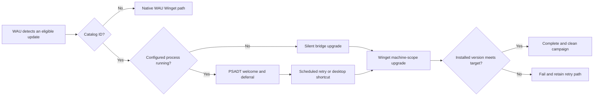

<div align="center">

# WAU PSADT Bridge

**Process-aware PSAppDeployToolkit experiences for selected Winget-AutoUpdate upgrades.**

[](https://github.com/modernendpointde/wau-psadt-bridge/actions/workflows/tests.yml)
[](https://github.com/modernendpointde/wau-psadt-bridge/releases)
[](LICENSE)


[Overview](#overview) · [Quick start](#quick-start) · [How it works](#how-it-works) · [Configuration](#configuration) · [Testing](#testing) · [Documentation](#documentation)

</div>

> [!IMPORTANT]
> This project is a preview. The supported combination is Windows x64, Winget-AutoUpdate 2.12.0 installed from the MSI package, and PSAppDeployToolkit 4.1.8. Other WAU builds are rejected during bridge installation.

## Overview

WAU PSADT Bridge connects [Winget-AutoUpdate](https://github.com/Romanitho/Winget-AutoUpdate) (WAU) with [PSAppDeployToolkit](https://github.com/PSAppDeployToolkit/PSAppDeployToolkit) (PSADT) without replacing WAU's update-selection logic.

WAU continues to decide which applications are eligible for an update. Applications listed in the bridge catalog are handed off to PSADT for process-aware user interaction, deferral, retry, and verified Winget execution. Every other application remains on the native WAU path.

| Responsibility | Owner |
|---|---|
| Update eligibility, include/exclude rules, outdated detection, and source selection | WAU |
| Selection of applications that receive the PSADT experience | Bridge catalog |
| Close-application dialog, deferral, deadline, progress, and completion UI | PSADT |
| Package download and machine-scope upgrade | Winget |
| Campaign state, scheduled retries, ownership validation, and cleanup | WAU PSADT Bridge |

### Key capabilities

- Catalog-based routing by exact Winget package ID
- Process-aware PSADT welcome dialog and application closure
- Silent upgrade when no configured application process is running
- Usage-day deferrals, randomized reminders, and a final deadline
- Public-desktop shortcut for resuming a deferred campaign
- Shared mutex that prevents overlapping PSADT and Winget activity
- Installed-version postcondition after every Winget upgrade
- Ownership-aware campaign recovery that preserves foreign or ambiguous resources
- English and German user-interface message packs
- Safe installation, reinstallation, and removal of the bridge integration

## Quick start

### Requirements

- Windows x64
- Winget-AutoUpdate 2.12.0 installed from the MSI package
- Administrator rights
- PowerShell 7 only when running the repository test suite

The bridge handles machine-scope updates from WAU's SYSTEM execution path. User-context WAU updates continue through native WAU processing.

> [!WARNING]
> WAU AutoUpdate can replace the patched `Update-App.ps1`. Do not upgrade WAU while the bridge is installed unless the target WAU version is explicitly listed as supported.

### Install

Run from the repository root in an elevated Windows PowerShell session:

```powershell
powershell.exe -NoProfile -ExecutionPolicy Bypass -File .\Install-WauPsadtBridge.ps1
```

The installer:

1. Locates the existing WAU installation.
2. Verifies WAU 2.12.0 and the SHA-256 of its stock `Update-App.ps1`.
3. Preserves the supported original file as `Update-App.ps1.pre-bridge`.
4. Installs the WAU handoff functions and bridge catalog.
5. Installs the immutable PSADT template under native Program Files.
6. Creates the protected working directory and applies the required ACLs.

The bridge does not create or replace WAU's primary scheduled task. Updates continue to run through `\WAU\Winget-AutoUpdate`.

### Uninstall

```powershell
powershell.exe -NoProfile -ExecutionPolicy Bypass -File .\Install-WauPsadtBridge.ps1 -Uninstall
```

Uninstall restores the original supported WAU file only when its identity can be proven. Bridge-managed files and empty staging parents are removed. Non-empty campaign directories and WAU's own scheduled tasks are preserved.

## How it works



WAU calls `Submit-WauPsadtUpdate` for every offered package. The handoff follows these rules:

| Situation | Result |
|---|---|
| The WAU cycle is not running as SYSTEM | Native WAU Winget path |
| The catalog is missing or structurally invalid | Stop the WAU cycle |
| The package ID is not cataloged or the source is not `winget` | Native WAU Winget path |
| The catalog entry is invalid | Skip the package without native fallback |
| App-specific WAU modifications exist | Skip the package without native fallback |
| The shared mutex is already held | Skip this cycle |
| A healthy active campaign exists | Keep the campaign and skip this cycle |
| A campaign is incomplete and every remaining resource is proven to be owned | Remove the orphan and allow a fresh campaign |
| A task, staging path, state file, shortcut, or registry contract cannot be proven | Preserve every resource and skip the package |
| No blocking condition exists | Create the working copy and start the PSADT bridge |

### Runtime behavior

- **No catalog process running:** Winget runs silently. Progress and completion UI appear only when enabled and exactly one interactive user is available.
- **Catalog process running:** PSADT presents the close-application and deferral experience to the interactive session that owns the process.
- **Session guard unavailable:** Retry infrastructure is registered, but no user interface is shown from an unsafe or ambiguous session.
- **Deferred campaign:** A public-desktop shortcut starts the owned retry task without changing the stored deadline.
- **Completed upgrade:** Success requires both an accepted Winget exit code and an installed version equal to or newer than the campaign target.

## User experience

The examples below show an English 7-Zip campaign. Dialogs follow the interactive user's Windows display language.

<table>
  <tr>
    <td align="center"><strong>Before the deadline</strong><br></td>
    <td align="center"><strong>After the deadline</strong><br></td>
  </tr>
  <tr>
    <td align="center"><strong>Upgrade progress</strong><br></td>
    <td align="center"><strong>Completion</strong><br></td>
  </tr>
</table>

<p align="center">
  <strong>Deferred campaign shortcut</strong><br>
  
</p>

## Catalog

[`catalog/apps.json`](catalog/apps.json) contains the applications routed through PSADT. It is installed as `C:\Program Files\WauPsadtBridge\bridge.catalog.json`.

```json
{
  "schemaVersion": 1,
  "apps": {
    "7zip.7zip": {
      "displayName": "7-Zip",
      "processes": ["7zFM", "7zG"]
    },
    "Mozilla.Firefox.de": {
      "displayName": "Mozilla Firefox",
      "processes": ["firefox"]
    }
  }
}
```

Catalog keys are exact Winget package IDs. Locale-specific packages use separate entries. Process values are exact `Get-Process -Name` names without paths, `.exe` suffixes, or wildcard characters.

| Winget ID | Display name | Processes |
|---|---|---|
| `7zip.7zip` | 7-Zip | `7zFM`, `7zG` |
| `Google.Chrome` | Google Chrome | `chrome` |
| `Mozilla.Firefox` | Mozilla Firefox | `firefox` |
| `Mozilla.Firefox.de` | Mozilla Firefox | `firefox` |

A structurally invalid catalog stops the WAU cycle. An invalid individual entry is skipped without falling back to native WAU for that package. See [`catalog/campaign.example.json`](catalog/campaign.example.json) for the immutable campaign payload created during handoff.

## Configuration

Bridge policy is defined in [`template/App/WauBridge.Config.ps1`](template/App/WauBridge.Config.ps1). Campaign JSON carries package identity, target version, and process names; it does not override global policy.

### Retry policy

| Setting | Default | Purpose |
|---|---:|---|
| `Enable` | `$true` | Allow deferral when an upgrade is needed and a catalog process is running |
| `Days` | `3` | Usage days, including the first prompt |
| `TimesPerDay` | `1` | Random reminder count on later usage days |
| `SkipWeekends` | `$true` | Exclude Saturday and Sunday from scheduled times |
| `HoursStart` | `08:00` | Beginning of the local usage window |
| `HoursEnd` | `17:00` | End of the local usage window |

The first welcome dialog consumes the first usage-day slot. Later reminders are randomized inside the configured window. The last scheduled time is the campaign deadline.

### User experience

| Setting | Default | Purpose |
|---|---:|---|
| `ShowProgressSilent` | `$true` | Show progress for a silent-path upgrade when one interactive user exists |
| `ShowProgressInteractive` | `$true` | Show progress after the welcome dialog |
| `ShowSuccess` | `$true` | Show a completion prompt after a successful upgrade |
| `ShowRestartPrompt` | `$true` | Show a restart prompt for Winget reboot exit codes |
| `RestartPromptNoCountdown` | `$false` | Disable the restart countdown |
| `RestartCountdownSeconds` | `1800` | Restart countdown duration |
| `RestartCountdownNoHideSeconds` | `300` | Time for which the restart countdown remains visible |
| `CloseCountdownSeconds` | `300` | Forced close-application countdown after the deadline |

### Localization and PSADT

| Setting | Default | Purpose |
|---|---:|---|
| `Localization.Culture` | `Auto` | Resolve the interactive user's Windows display language |
| `Localization.DefaultCulture` | `en-US` | Fallback language |
| `Localization.MessagesPath` | `Messages` | Package-relative message directory |
| `Toolkit.CompanyName` | `WAU PSADT Bridge` | PSADT fallback title and notification branding |
| `UI.DefaultTimeout` | `3300` | PSADT dialog timeout in seconds |

Message packs are stored in [`template/Messages/`](template/Messages/). The repository ships `en-US` and `de-DE`.

## Safety and recovery

Campaign cleanup is ownership-based. Registry state alone is not sufficient authority to remove files, tasks, or shortcuts.

| Campaign classification | Behavior |
|---|---|
| Healthy | Preserve the existing campaign |
| Recoverable orphan | Remove only resources whose complete ownership contract is proven, then allow recreation |
| Unproven or foreign collision | Preserve all resources, log the conflict, and fail closed for the package |

Additional safeguards include:

- SHA-256 validation of the supported WAU backup before installation or restoration
- Canonical path and containment validation before recursive staging cleanup
- Exact scheduled-task action, principal, description, and trigger validation
- Exact desktop-shortcut target and argument validation
- Fail-closed catalog and process-name validation
- Installed-version verification after Winget reports success

## Concurrency

All SYSTEM update paths share `Global\WauPsadtBridge.Update` with non-blocking acquisition. Only one bridge UI or Winget operation can run at a time.

If another catalog application's welcome dialog holds the mutex, a later package in the same WAU cycle exits with code `1618`. That package remains on its installed version until a later WAU cycle or its own existing reminder task. The bridge does not maintain an in-cycle queue.

## Testing

Run the complete automated suite with PowerShell 7:

```powershell
pwsh -NoProfile -File ./tests/Run-Tests.ps1
```

GitHub Actions runs the same suite on Windows for pushes to `main`, version tags, pull requests, and manual workflow runs. The automated checks validate repository contracts and isolated lifecycle behavior; real Winget, SYSTEM, scheduled-task, and PSADT UI behavior remains part of the manual integration checklist.

See [Testing](docs/TESTING.md) for prerequisites, coverage, expected results, and manual release validation.

## Installed layout

The native 64-bit Program Files path is used even when the installer is launched from a 32-bit process.

| Path | Purpose |
|---|---|
| `C:\Program Files\Winget-AutoUpdate\functions\Submit-WauPsadtUpdate.ps1` | WAU-to-bridge handoff |
| `C:\Program Files\Winget-AutoUpdate\functions\Update-App.ps1` | Supported WAU function with the bridge handoff |
| `C:\Program Files\WauPsadtBridge\bridge.catalog.json` | Installed application catalog |
| `C:\Program Files\WauPsadtBridge\Template\` | Immutable golden PSADT template |
| `C:\Program Files\WauPsadtBridge\Work\<guid>\` | Short-lived protected bootstrap copy |
| `C:\Program Files\WauPsadtBridge\Stage\<PackageId>\<TargetVersion>\` | Persistent deferred-campaign staging root |
| `\WauPsadtBridge\` | Task Scheduler folder for retry and cleanup tasks |
| `HKLM:\SOFTWARE\WauPsadtBridge\Campaigns\<CampaignId>` | Campaign registry state |

## Known limitations

- Only the Winget community source is handled by the bridge.
- Microsoft Store and custom sources remain outside the bridge path.
- Only machine-scope updates from WAU's SYSTEM execution path are handled.
- Catalog process names are maintained manually.
- Multiple catalog upgrades are serialized and are not queued within one WAU cycle.
- Supported WAU versions are pinned and must be added explicitly.

## Documentation

| Document | Purpose |
|---|---|
| [Changelog](CHANGELOG.md) | Version history and release changes |
| [Testing guide](docs/TESTING.md) | Automated and manual validation |
| [Technical reference](template/TECHNICAL-REFERENCE.md) | Load order, runtime state, ownership, scheduling, and cleanup contracts |
| [Message-pack guide](template/Messages/README.md) | Localization contract and language-pack structure |
| [Third-party notices](NOTICE.md) | Vendored components, origins, versions, and licenses |

## License

Original WAU PSADT Bridge code is licensed under the [MIT License](LICENSE).

Vendored and PSAppDeployToolkit-derived files retain their LGPL-3.0 licensing. `wau/Update-App.ps1` remains under the upstream Winget-AutoUpdate MIT license. See [Third-party notices](NOTICE.md) for details.
