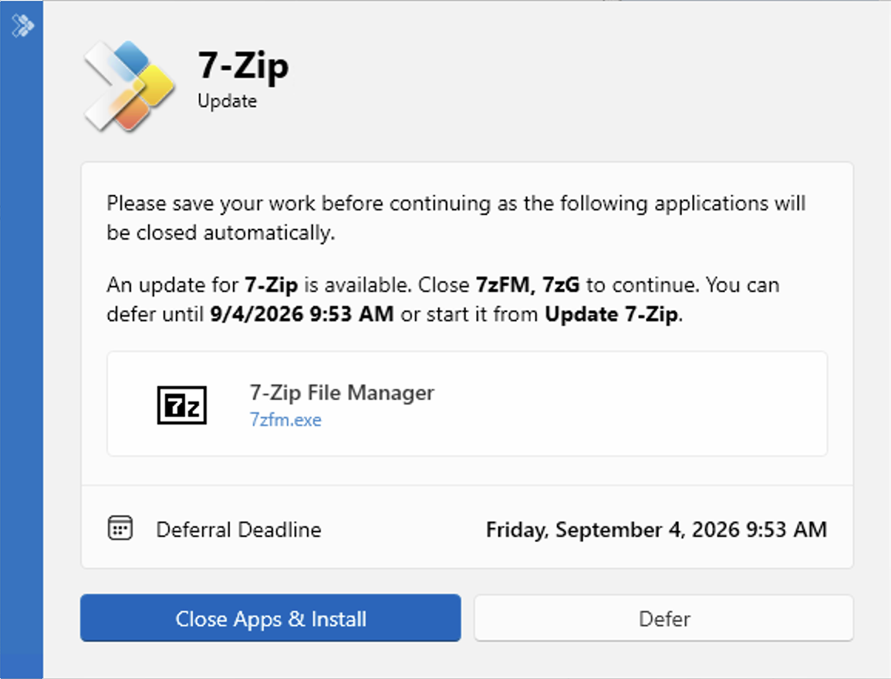
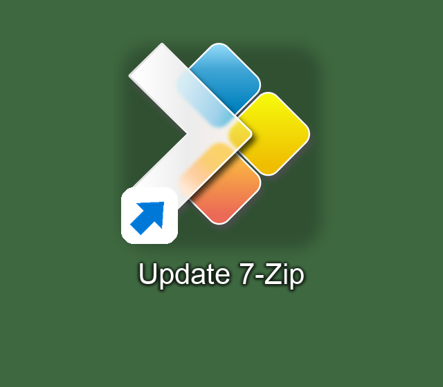
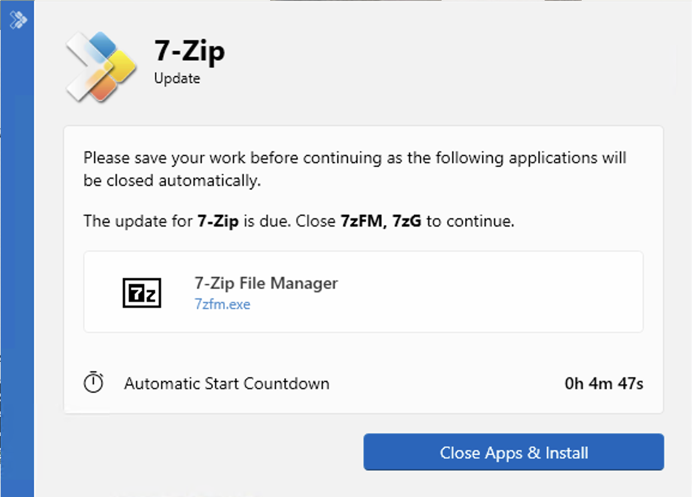
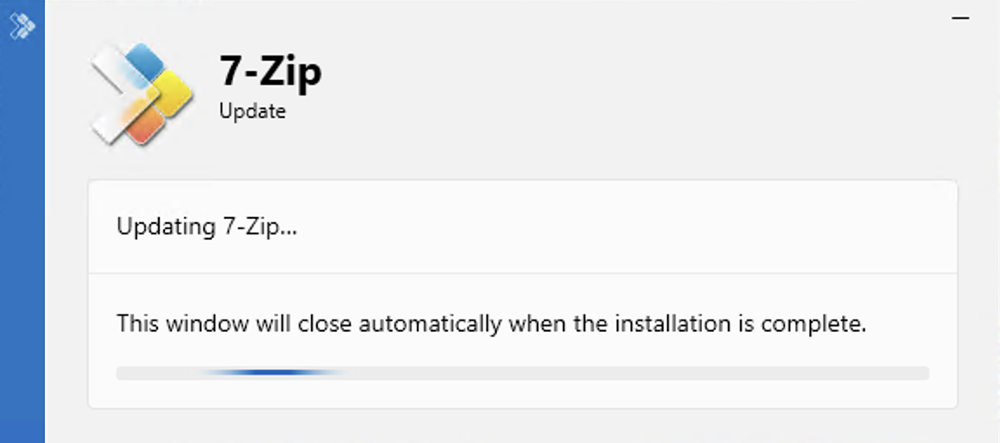
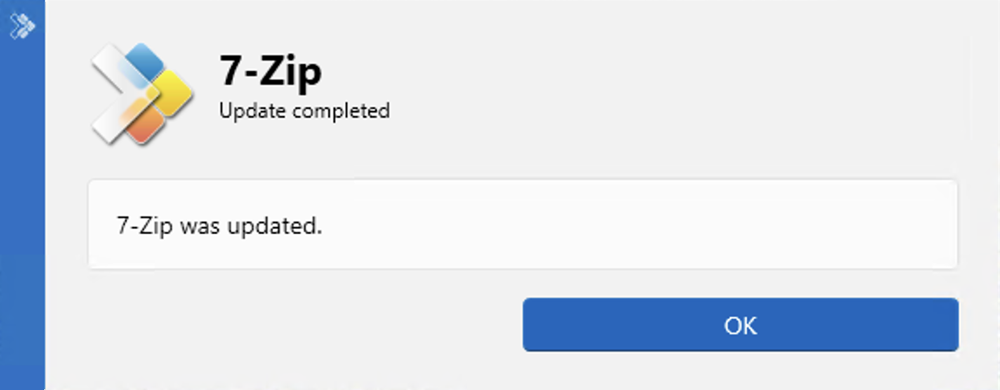

# WAU PSADT Bridge

Hands selected [Winget-AutoUpdate](https://github.com/Romanitho/Winget-AutoUpdate) (WAU) upgrades to [PSAppDeployToolkit](https://github.com/PSAppDeployToolkit/PSAppDeployToolkit) 4.1.8.

WAU still decides *which* apps are offered (include/exclude, outdated, source). The catalog decides *how* those apps are installed: through PSADT, or through WAU Winget.

Catalog apps get a close-apps dialog, deferral across usage days, a deadline, progress while Winget runs, and a completion prompt. Apps that are not in the catalog continue through WAU.

Template internals (load order, tasks, state, ownership): [`template/TECHNICAL-REFERENCE.md`](template/TECHNICAL-REFERENCE.md).

## Requirements

- Windows
- [Winget-AutoUpdate](https://github.com/Romanitho/Winget-AutoUpdate) **2.12.0** from the MSI
- Administrator rights to install the bridge

Tested / supported: WAU **2.12.0**, PSAppDeployToolkit **4.1.8**. Other WAU builds are rejected at install. WAU AutoUpdate is on by default and can replace the patched `Update-App.ps1`; do not upgrade WAU until that version is listed here.

The bridge handles machine-scope updates from WAU’s SYSTEM execution path. User-context WAU updates remain native WAU updates.

## Install

From the repository root:

```powershell
powershell.exe -NoProfile -ExecutionPolicy Bypass -File .\Install-WauPsadtBridge.ps1
```

The script copies files onto the machine. It does not create a scheduled task. Updates keep using `\WAU\Winget-AutoUpdate`.

1. Locates WAU (`HKLM:\SOFTWARE\Romanitho\Winget-AutoUpdate\InstallLocation`, otherwise `C:\Program Files\Winget-AutoUpdate`).
2. Checks that WAU is **2.12.0** and that `functions\Update-App.ps1` is that stock file or already contains the bridge handoff. An unknown file aborts the install. Reinstall aborts if the handoff is present and no valid original `.pre-bridge` backup exists.
3. Backs up `functions\Update-App.ps1` to `Update-App.ps1.pre-bridge` only when that file is not already patched.
4. Copies `wau\Submit-WauPsadtUpdate.ps1` and `wau\Update-App.ps1` into WAU `\functions`.
5. Copies `catalog\apps.json` to `C:\Program Files\WauPsadtBridge\bridge.catalog.json`.
6. Copies `template\` to `C:\Program Files\WauPsadtBridge\Template\`.
7. Creates `C:\Program Files\WauPsadtBridge\Work\`.
8. Sets directory ACLs on the bridge root, Template, and Work: SYSTEM and Administrators full control, Users read and execute.

```powershell
powershell.exe -NoProfile -ExecutionPolicy Bypass -File .\Install-WauPsadtBridge.ps1 -Uninstall
```

Uninstall restores WAU `Update-App.ps1` from the backup only when that file still contains the bridge handoff. If WAU has already replaced it, the current file is left in place. If the backup is missing while the handoff is still present, uninstall aborts and changes nothing. The copied Submit function, `bridge.catalog.json`, `install-state.json`, the golden template, and `Work\` are removed. WAU scheduled tasks are left unchanged. Existing campaign folders under `WauPsadtBridge\Stage\<Id>\<Version>` are left in place. The `WauPsadtBridge` root is removed only if it is then empty.

## How an update runs

WAU’s scheduled task `\WAU\Winget-AutoUpdate` still drives the cycle. For each offered package, `Update-App.ps1` calls `Submit-WauPsadtUpdate`:

| Situation | What happens |
|---|---|
| Not a SYSTEM WAU cycle | Native WAU Winget. The bridge mutex is not taken. |
| Catalog file missing or invalid | The WAU cycle stops. |
| ID not in the catalog, or source is not `winget` | Native WAU Winget. |
| ID is in the catalog, but the entry is invalid | This ID is skipped (no WAU Winget, no bridge). |
| App-specific WAU mods present | This ID is skipped (no WAU Winget, no bridge). |
| Mutex held, or an active campaign already exists for this ID | Skipped this cycle. |
| Otherwise | Working copy of the template, `WauBridge.Campaign.json`, `install.ps1`. |

When the template runs:

- No catalog process running → silent `winget upgrade`, then progress/success UI if Config allows and exactly one interactive user is present.
- Catalog process running and exactly one interactive session that owns that process → Welcome (close-apps, defer until the deadline). The first Welcome is today’s slot. Later usage days get `TimesPerDay` random times in `HoursStart`–`HoursEnd`. The last of those times is the deadline. After the deadline, if Welcome was already shown, close-apps uses `CloseCountdownSeconds`.
- A public-desktop shortcut starts the owned retry task. Starting it does not change the stored deadline.
- Catalog process running, but the session guard fails (no user, or more than one active session, or the process is in another session) → retry infrastructure is registered; Welcome is not shown in this process.

IDs on WAU’s exclude list are never offered to the bridge.

## User interface

Example from a 7-Zip catalog upgrade (`en-US`). Dialogs follow the interactive user’s Windows display language.

**Before the deadline**



**Public-desktop shortcut**

<p></p>

**After the deadline**



**Progress**



**Completion**



## Catalog

`catalog/apps.json` is installed as `bridge.catalog.json`. Keys are exact Winget package IDs (`-ieq`). Locale variants are separate keys.

```json
{
  "schemaVersion": 1,
  "apps": {
    "7zip.7zip": {
      "displayName": "7-Zip",
      "processes": ["7zFM", "7zG"]
    },
    "Mozilla.Firefox.de": {
      "displayName": "Mozilla Firefox",
      "processes": ["firefox"]
    }
  }
}
```

`processes` are `Get-Process -Name` values (no path, no `.exe`). A valid catalog with an invalid process list on one ID skips that ID (no native WAU, no bridge) and keeps the file valid.

Shipped IDs:

| Winget ID | Display name | Processes |
|---|---|---|
| `7zip.7zip` | 7-Zip | `7zFM`, `7zG` |
| `Google.Chrome` | Google Chrome | `chrome` |
| `Mozilla.Firefox` | Mozilla Firefox | `firefox` |
| `Mozilla.Firefox.de` | Mozilla Firefox | `firefox` |

Campaign JSON written at handoff: [`catalog/campaign.example.json`](catalog/campaign.example.json). It carries identity, target version, and process names only.

## Configuration

Retry, UX flags, and localization are in [`template/App/WauBridge.Config.ps1`](template/App/WauBridge.Config.ps1). The campaign JSON does not overlay these values.

### Retry (`Retry`)

| Field | Default | Meaning |
|---|---|---|
| `Enable` | `$true` | Deferral when the operation is Upgrade and a catalog process is running. |
| `Days` | `3` | Usage days including today (1–5). |
| `TimesPerDay` | `1` | Random reminders per later usage day (`1` or `2`). |
| `SkipWeekends` | `$true` | Skip Saturday and Sunday for scheduled times. |
| `HoursStart` | `08:00` | Start of the local usage window (`HH:mm`). |
| `HoursEnd` | `17:00` | End of the local usage window (`HH:mm`). |

The first Welcome dialog consumes today’s slot. Remaining times are random inside the window, not at `HoursStart` or `HoursEnd`. The last of those times is the deadline.

### User experience (`UserExperience`)

| Field | Default | Meaning |
|---|---|---|
| `ShowProgressSilent` | `$true` | Progress UI when no catalog process is running (still requires one interactive user). |
| `ShowProgressInteractive` | `$true` | Progress UI after Welcome. |
| `ShowSuccess` | `$true` | Completion prompt after a successful upgrade (one interactive user). |
| `ShowRestartPrompt` | `$true` | Restart prompt when Winget returns a reboot exit code. |
| `RestartPromptNoCountdown` | `$false` | Restart prompt without countdown. |
| `RestartCountdownSeconds` | `1800` | Restart countdown. |
| `RestartCountdownNoHideSeconds` | `300` | Restart countdown stays visible for this many seconds. |
| `CloseCountdownSeconds` | `300` | Close-apps countdown after the deadline, only if Welcome was already shown. |

Texts come from [`template/Messages/`](template/Messages/).

### Localization (`Localization`)

| Field | Default | Meaning |
|---|---|---|
| `Culture` | `Auto` | Interactive user’s Windows display language, then parent cultures. |
| `DefaultCulture` | `en-US` | Fallback after parent cultures. |
| `MessagesPath` | `Messages` | Package-relative culture-pack directory. |

### PSADT overlay

[`template/Config/config.psd1`](template/Config/config.psd1):

| Field | Default | Meaning |
|---|---|---|
| `Toolkit.CompanyName` | `WAU PSADT Bridge` | Fallback title / balloon branding. |
| `UI.DefaultTimeout` | `3300` | Seconds until a PSADT dialog times out. |

### Execution

| Field | Default | Meaning |
|---|---|---|
| `SuccessExitCodes` | `0` | Winget success without reboot. |
| `RebootExitCodes` | `1641`, `3010` | Success that requests a reboot. |
| `RequireAdmin` | `$true` | Passed to the PSADT session. |

## Languages

Shipped packs: `en-US`, `de-DE`. Add a language by copying `template/Messages/en-US.psd1` to `template/Messages/<BCP-47>.psd1`. See [`template/Messages/README.md`](template/Messages/README.md).

## Concurrency

One mutex: `Global\WauPsadtBridge.Update`, `WaitOne(0)`, only in a SYSTEM WAU cycle. There is no in-cycle queue. If a catalog app’s Welcome still holds the mutex, the next catalog ID’s bootstrap exits **1618**. WAU treats that as a completed handoff (`Submit` returns `$true`) and does not run native Winget for that ID. The skipped app stays on the installed version until a later WAU cycle or its own reminder task.

The same mutex is used by the non-catalog WAU Winget path when that path runs as SYSTEM.

## Layout after install

On 64-bit Windows the native Program Files folder is used (`ProgramW6432`), so a 32-bit process does not install or look under `Program Files (x86)`. Typical paths:

| Path | Content |
|---|---|
| `C:\Program Files\Winget-AutoUpdate\functions\Submit-WauPsadtUpdate.ps1` | Handoff from WAU |
| `C:\Program Files\Winget-AutoUpdate\functions\Update-App.ps1` | Calls the handoff, then WAU Winget |
| `C:\Program Files\WauPsadtBridge\bridge.catalog.json` | Apps that use PSADT |
| `C:\Program Files\WauPsadtBridge\Template\` | Golden template |
| `C:\Program Files\WauPsadtBridge\Work\<guid>\` | Short-lived bootstrap working copy; removed after bootstrap |
| `C:\Program Files\WauPsadtBridge\Stage\<PackageId>\<TargetVersion>\` | Persistent stage root while an update is deferred |
| `\WauPsadtBridge\` | Task Scheduler folder (`Update_*`, `Cleanup_*`) |
| `HKLM:\SOFTWARE\WauPsadtBridge\Campaigns\<CampaignId>` | Campaign state |
| Mutex `Global\WauPsadtBridge.Update` | One active UI or installation |

## License

Original WauPsadtBridge code is licensed under MIT. Vendored and PSAppDeployToolkit-derived files retain their LGPL-3.0 licensing. `wau/Update-App.ps1` remains under the upstream Winget-AutoUpdate MIT license. See [NOTICE.md](NOTICE.md).
