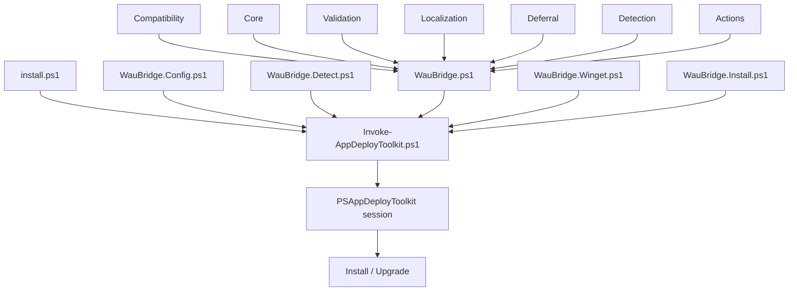
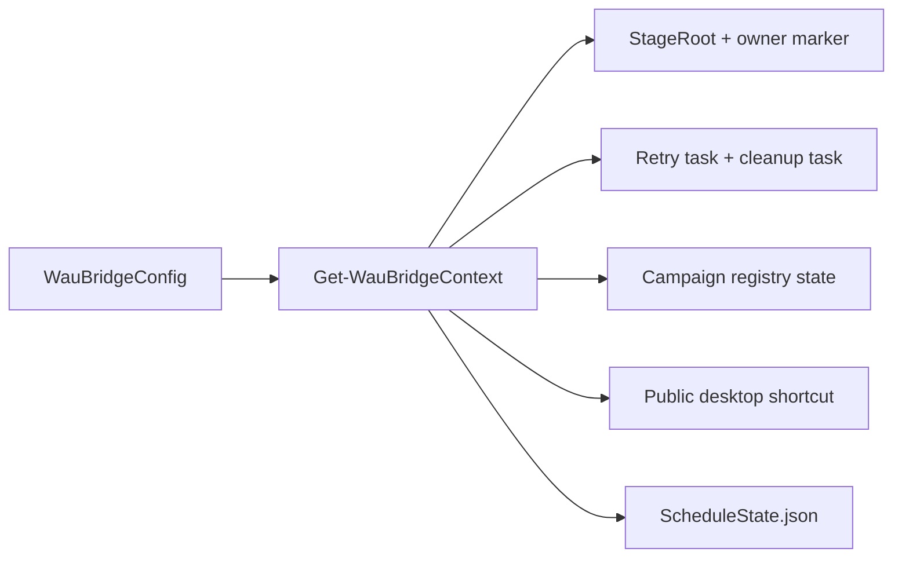
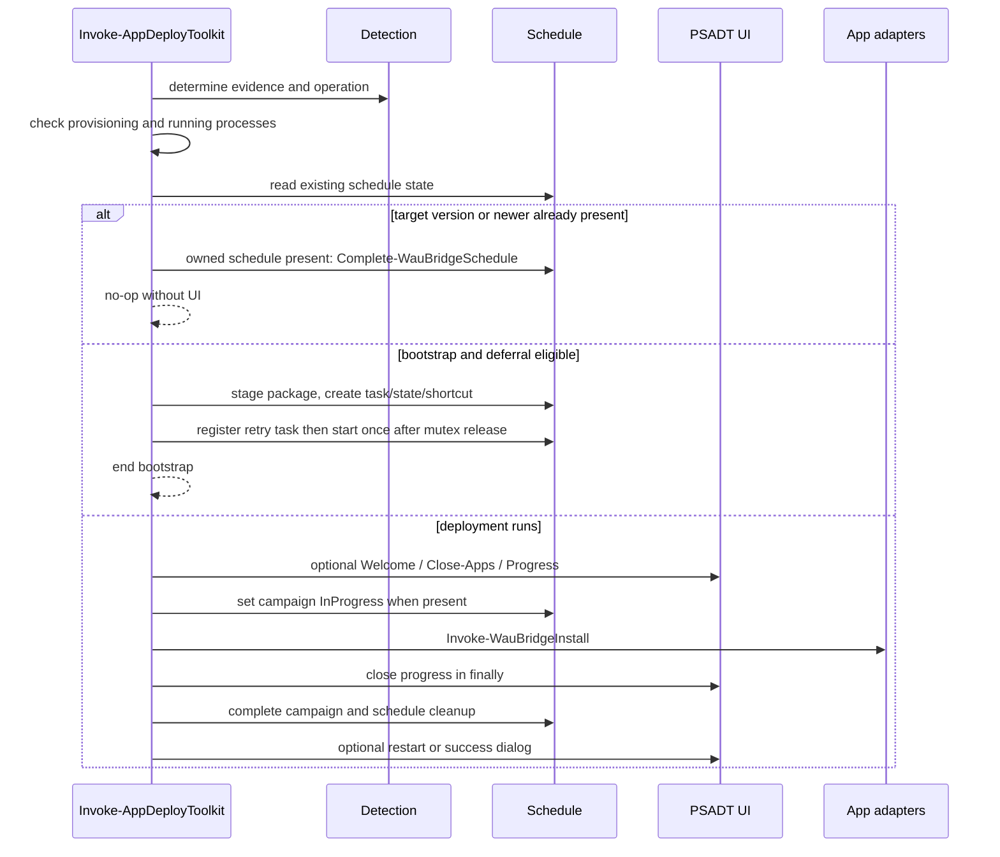

# WauBridge template technical reference

## 1. Purpose and scope

This directory is the WAU PSADT Bridge golden copy on PSAppDeployToolkit 4.1.8. It upgrades catalog apps with Winget: close-apps, deferral, deadline, localization, campaign state, and cleanup of owned staging.

This reference describes the source in this directory: the PowerShell components the template owns, how they call each other, and the Windows resources they create. The bundled PSADT directories are third-party code. The framework imports them; it does not modify them.

`Install-WauPsadtBridge.ps1` copies this tree to `C:\Program Files\WauPsadtBridge\Template\`. WAU copies that golden tree into `C:\Program Files\WauPsadtBridge\Work\<guid>\`, writes `WauBridge.Campaign.json`, and runs `install.ps1`. That campaign file is required. If the update is deferred, the existing `Stage\<PackageId>\<TargetVersion>` copy is used; `Work\` is not the persistent campaign stage. The template does not install from `Files/`, uninstall, or repair.

## 2. System boundaries

| Area | Responsibility |
|---|---|
| Package configuration | `App/WauBridge.Config.ps1` holds policy; `Config/config.psd1` holds PSADT UI timeout and company name; `WauBridge.Campaign.json` adds identity, target version, and processes. |
| Package-specific code | `App/` holds Winget detection and Winget upgrade. |
| Framework | `Framework/` validates configuration and implements shared runtime contracts. |
| PSADT | `PSAppDeployToolkit/` supplies session, UI, logging, and process adapters. |
| Language resources | `Messages/` holds the message contract and BCP-47 culture packs. |
| Manual start | An ownership-checked public-desktop shortcut starts the owned retry task (`Start-ScheduledTask`). |
| Windows integration | Task Scheduler, HKLM registry, the public-desktop shortcut, and Robocopy run on Windows. |

Native Windows execution must be validated on a Windows test system.

## 3. Directory and component map

```text
.
├── App/
│   ├── WauBridge.Config.ps1          retry and UX policy; identity comes from campaign JSON
│   ├── WauBridge.Detect.ps1          Winget version and presence
│   └── WauBridge.Install.ps1         winget upgrade
├── Assets/                     packaged icons and banner
├── Config/                     PSADT UI timeout and company name
├── Framework/
│   ├── WauBridge.ps1      ordered framework loader
│   ├── WauBridge.Compatibility.ps1  Windows staging, tasks, registry, shortcuts
│   ├── WauBridge.Core.ps1           result, path, culture, and time helpers
│   ├── WauBridge.Validation.ps1     aggregate preflight
│   ├── WauBridge.Localization.ps1   culture-pack resolution and rendering
│   ├── WauBridge.Deferral.ps1       deadline and reminder model
│   ├── WauBridge.Detection.ps1      evidence and operation model
│   ├── WauBridge.Actions.ps1        result and progress contracts
│   ├── WauBridge.Winget.ps1         winget export / upgrade
│   └── WauBridge.CampaignJson.ps1   required WauBridge.Campaign.json overlay
├── Messages/                   message contract and culture packs
├── PSAppDeployToolkit/         unmodified PSADT module
├── Invoke-AppDeployToolkit.ps1 install/upgrade lifecycle
├── install.ps1                 install bootstrap
└── Cleanup-WauBridgePackage.ps1 delayed staging cleanup
```

## 4. Entry points

| File | Invocation | Behavior |
|---|---|---|
| `install.ps1` | no parameters | Starts 64-bit Windows PowerShell when reachable through `Sysnative`, then calls `Invoke-AppDeployToolkit.ps1 -DeploymentType Install -DeployMode Interactive -InvocationSource Bootstrap`. |
| `Invoke-AppDeployToolkit.ps1` | see parameter contract | Requires `WauBridge.Campaign.json`, opens the PSADT session, and runs the install/upgrade lifecycle. |
| `Cleanup-WauBridgePackage.ps1` | cleanup task | After five seconds removes the two campaign tasks, campaign state, state file, and StageRoot. |

Parameters of `Invoke-AppDeployToolkit.ps1`:

| Parameter | Allowed values / type | Default |
|---|---|---|
| `DeploymentType` | `Install` | `Install` |
| `DeployMode` | `Interactive`, `Silent`, `NonInteractive`, `Auto` | `Interactive` |
| `AllowRebootPassThru` | switch | off |
| `TerminalServerMode` | switch | off |
| `DisableLogging` | switch | off |
| `InvocationSource` | `Bootstrap`, `RetryTask` | `Bootstrap` |

The bootstrap scripts return the exit code of the started PowerShell process unchanged.

## 5. Load order and function resolution

`Invoke-AppDeployToolkit.ps1` dot-sources components in this order:

1. `App/WauBridge.Config.ps1`
2. `App/WauBridge.Detect.ps1`
3. `Framework/WauBridge.ps1`
4. `Framework/WauBridge.Winget.ps1`
5. `App/WauBridge.Install.ps1`
6. `Import-WauBridgeCampaignJson` (required); throws if `WauBridge.Campaign.json` is missing, then `Assert-WauBridgeConfiguration`

`WauBridge.ps1` loads:

1. `WauBridge.Compatibility.ps1`
2. `WauBridge.Core.ps1`
3. `WauBridge.Validation.ps1`
4. `WauBridge.Localization.ps1`
5. `WauBridge.Deferral.ps1`
6. `WauBridge.Detection.ps1`
7. `WauBridge.Actions.ps1`
8. `WauBridge.CampaignJson.ps1`

`WauBridge.Winget.ps1` loads after the framework because `WauBridge.Detect.ps1` calls its functions at runtime.



## 6. Initialization and preflight

After all owned scripts are loaded, the main entry overlays `WauBridge.Campaign.json` onto the config hashtable, then calls `Assert-WauBridgeConfiguration`. That function:

1. runs compatibility validation (identity from the overlay, policy from Config);
2. collects extra errors for localization, deferral, and exit codes;
3. validates every discovered culture pack;
4. throws one aggregated error before a PSADT session opens or a deployment-owned resource is changed.

There are no in-memory defaults for missing policy fields. Runtime context and PSADT session parameters are created after that check.

The main entry prefers the bundled `PSAppDeployToolkit/PSAppDeployToolkit.psd1`. If that file is missing, it imports an installed module named `PSAppDeployToolkit`. After the session opens, directories matching `PSAppDeployToolkit.*` are imported as extensions.

A failure opening the PSADT session exits `60008`. Unhandled errors after a successful session open are logged and close the session with `60001`.

## 7. Configuration contract

`App/WauBridge.Config.ps1` is policy only. It does not hold package identity, task names, or paths. `WauBridge.Campaign.json` adds `PackageId`, `DisplayName`, `TargetVersion`, and `ProcessDefinitions` before preflight.

### 7.1 Global execution

| Field | Meaning |
|---|---|
| `SuccessExitCodes` | Successful exit codes without reboot. |
| `RebootExitCodes` | Successful exit codes that request a reboot. |
| `RequireAdmin` | Passed to the PSADT session. |

`SuccessExitCodes` and `RebootExitCodes` are disjoint.

Identity after overlay:

| Field | Meaning |
|---|---|
| `PackageId` | Exact Winget ID; Windows path reserved characters are rejected. Used for detection, upgrade, and resource names. |
| `DisplayName` | UI name (`{AppName}` in culture packs). |
| `TargetVersion` | Target version and part of the campaign identity. |
| `ProcessDefinitions` | `Get-Process -Name` strings. Running names trigger the close-apps dialog and deferral. |

### 7.2 Detection and install

Presence and version come from `winget export` with `PackageId`. Localized console text is not treated as evidence. Presence without a parseable version is an upgrade.

The adapter runs `winget upgrade --id <PackageId> --silent` and then requires `InstalledVersion >= TargetVersion`. There is no uninstall or repair lifecycle.

`Get-WauBridgeWingetInstalledVersion` uses `winget export --include-versions`. `Test-WauBridgeWingetPackagePresent` uses `winget export` without versions.

### 7.3 Localization

| Field | Meaning |
|---|---|
| `Culture` | `Auto` or a valid BCP-47 culture tag. |
| `DefaultCulture` | Valid, non-invariant default culture. |
| `MessagesPath` | Safe package-relative path to the messages directory. |

### 7.4 User experience

| Field | Meaning |
|---|---|
| `ShowSuccess` | Completion prompt after a successful upgrade. |
| `ShowRestartPrompt` | Restart prompt when the adapter returns a reboot exit code. |
| `RestartPromptNoCountdown` | Restart prompt without countdown. |
| `RestartCountdownSeconds` | Restart countdown length. |
| `RestartCountdownNoHideSeconds` | Restart countdown remains visible for this many seconds. |
| `CloseCountdownSeconds` | Welcome `CloseProcessesCountdown` after the deadline when `PromptShownCount` is at least 1. Range 1–3600. |
| `ShowProgressSilent` | Progress UI when no catalog process is running. |
| `ShowProgressInteractive` | Progress UI after Welcome. |

Texts come from the active culture pack. Progress and success UI also require exactly one interactive user (`Test-WauBridgeHasInteractiveUser`).

`Config/config.psd1` is the PSADT overlay used by this template: `Toolkit.CompanyName` is `WAU PSADT Bridge`, `UI.DefaultTimeout` is 3300 seconds.

### 7.5 Deferral and reminders

| Field | Contract |
|---|---|
| `Enable` | Master switch for deferral campaigns. Deferral runs only for an upgrade when a catalog process is running. |
| `Days` | Usage days in the campaign, including today; 1 through 5. |
| `TimesPerDay` | Reminders per usage day; `1` or `2`. |
| `SkipWeekends` | When true, scheduled triggers skip Saturday and Sunday. |
| `HoursStart`, `HoursEnd` | Local `HH:mm` window for scheduled retry tasks. |

Task folder, task names, StageRoot, and the registry base path are derived in `Get-WauBridgeContext`. They are not Config fields. Shortcut names come from the culture pack.

## 8. Runtime context and resources

`Get-WauBridgeContext` derives shared identifiers and paths once from configuration and the package root.

| Context field | Derivation |
|---|---|
| `Schedule.CampaignId` | sanitized `<PackageId>_<TargetVersion>` |
| `Schedule.CampaignRegistryPath` | `HKLM:\SOFTWARE\WauPsadtBridge\Campaigns\<CampaignId>` |
| `Schedule.TaskPath` | `\WauPsadtBridge\` |
| `Schedule.TaskName` | `Update_<PackageId>_<TargetVersion>` |
| `Schedule.CleanupTaskName` | `Cleanup_<PackageId>_<TargetVersion>` |
| `Runtime.StageRoot` | `%ProgramFiles%\WauPsadtBridge\Stage\<PackageId>\<TargetVersion>` |
| `Runtime.OwnerMarkerPath` | `<StageRoot>\.waubridge-owner.json` |
| `Schedule.StateFilePath` | `<StageRoot>\ScheduleState.json` |
| `Schedule.CleanupScriptPath` | `<StageRoot>\Cleanup-WauBridgePackage.ps1` |
| `Schedule.DesktopShortcutPath` | localized name on the public desktop |



## 9. Detection and operation model

`Get-WauBridgeDetectionEvidence` separates technical evidence from the install operation. `Get-WauBridgeInstallOperation` then maps evidence onto the lifecycle state.

| Evidence state | Meaning |
|---|---|
| `Versioned` | Application present and version parseable. |
| `PresentUnknownVersion` | Application present, target version unproven. |
| `Missing` | Current detection reports no presence. |

Mapping to operation:

| Evidence | Condition | Operation |
|---|---|---|
| `Versioned` | version lower than target | `Upgrade` |
| `Versioned` | version equal to target | `InstalledSameVersion` |
| `Versioned` | version higher than target | `InstalledNewerVersion` |
| `PresentUnknownVersion` | no parseable version | `Upgrade` |
| `Missing` | no presence | `Upgrade` |

`InstalledSameVersion` and `InstalledNewerVersion` are no-op states in the install lifecycle. A higher installed version is left in place. When an owned schedule is present (`Test-WauBridgeSchedulePresent`), the lifecycle calls `Complete-WauBridgeSchedule` (no UI, no installer).

Install/upgrade uses the same evidence. An active campaign is recognized when registry state is `Staged`, `Deferred`, or `InProgress`.

## 10. Install lifecycle



Provisioning is active when PSADT reports ESP activity or incomplete OOBE. The enrollment registry (`EnrollmentStatusTracking`) is used only when those PSADT adapters are both unavailable or both fail.

A schedule is created at bootstrap only when the operation is `Upgrade`, a catalog process is running, provisioning is inactive, the deadline has not passed, and `Days` is at least 1. `RetryTask` continues the lifecycle without this bootstrap short-circuit.

Bootstrap registers the retry task, releases the mutex, then starts the owned task at most once when the session guard allows it. Details are in section 22.

## 11. Repair and uninstall

This template has no repair or uninstall lifecycle. `DeploymentType` is `Install` only. A reboot exit code from upgrade remains a successful result and is forwarded as exit code `3010`.

## 12. Action-result contract

The Winget upgrade adapter is normalized to type `WauBridge.ActionResult`:

| Field | Meaning |
|---|---|
| `Operation` | `Upgrade`. |
| `Adapter` | `WingetScript`. |
| `ExitCode` | Numeric adapter exit code. |
| `Succeeded` | Exit code is in the success or reboot list. |
| `RebootRequired` | Exit code is in `RebootExitCodes`. |
| `Diagnostic` | Optional diagnostic value. |

The progress guard closes a visible progress UI on error and leaves the original error unchanged. `New-WauBridgeResult` creates the contract; `ConvertTo-WauBridgeResult` normalizes adapter returns and checks the exit code.

## 13. Deferral, deadline, and reminder schedule

All timing comes from `Retry` in `App/WauBridge.Config.ps1`. `Get-WauBridgeDeferralPolicy` copies those values; it does not substitute its own days, times, or hours.

- The first Welcome dialog counts as today’s slot. Bootstrap therefore registers only **future** triggers (`ConsumedNow=1` when a session can show UI).
- Remaining reminders: `TimesPerDay` random times on each later usage day, inside `HoursStart`–`HoursEnd`, not at `HoursStart` or `HoursEnd` sharp. Two times on one day keep a gap derived from the window length.
- The last of those times is the deadline (same random slot, no extra trigger at `HoursEnd`). A Friday evening start with `Days=3` ends with one random time on Tuesday.
- The Welcome dialog allows defer until that deadline. It does not use a separate defer-count field.
- `RetryTask` starts outside the usage window do not show UI; `Invoke-WauBridgeScheduleCatchUp` writes a future in-window time and keeps the stored deadline. After the deadline it still writes one future trigger without moving the deadline.
- If the session guard blocks a retry, catch-up still leaves a future trigger. The stored deadline and `PromptShownCount` are unchanged, so a later run after the deadline stays mandatory.
- A `RetryTask` that does not complete the campaign (mutex 1618 or a failed upgrade) also runs catch-up so the last one-shot trigger cannot leave the campaign without a future run.
- If provisioning is active and a catalog process is running, the run skips UI, close-apps, and Winget (exit 1618) and retries later. Silent upgrade during provisioning remains allowed when no catalog process is running.
- `CloseCountdownSeconds` from Config runs only after the deadline **and** after `PromptShownCount` is at least 1. `Add-WauBridgePromptShown` runs before `Show-ADTInstallationWelcome` and sets campaign state to `Deferred`, so a Defer click still records the prompt.

Desktop shortcut starts the owned retry task as SYSTEM. Authenticated Users may execute that task. `RetryTask` skips UI outside usage hours only when no interactive user is present, so a desktop start still shows Welcome. Bootstrap outside usage hours shows Welcome in that process and still registers in-window retry triggers.

When the stored policy changes, an owned retry task is treated as stale and registered again.

## 14. Schedule, state, and ownership contracts

The canonical schedule API is:

- `Get-WauBridgeScheduleState`
- `Test-WauBridgeSchedulePresent`
- `Register-WauBridgeSchedule`
- `Complete-WauBridgeSchedule`

Cleanup calls `Remove-WauBridgeSchedule` directly.

### 14.1 Staging

`Stage-WauBridgePackage` copies the package with Robocopy `/E`. Exit codes 0 through 7 are success; higher values abort. `/MIR` is unused. After a successful copy, `.waubridge-owner.json` is written with schema, ResourceType, CampaignId, PackageId, TargetVersion, and the canonical StageRoot.

Recursive StageRoot cleanup requires:

- a present, readable ownership marker;
- matching campaign, package, and version identity;
- a marker path inside the expected StageRoot;
- a contained path that is not a drive root.

### 14.2 Retry task

The retry task uses:

- Windows PowerShell from `%WINDIR%\System32`;
- the staged `Invoke-AppDeployToolkit.ps1`;
- `DeploymentType Install`, `DeployMode Interactive`, and `InvocationSource RetryTask`;
- principal `SYSTEM`, `ServiceAccount`, run level `Highest`;
- battery execution, `StartWhenAvailable`, and `MultipleInstances IgnoreNew`;
- the deterministic one-shot triggers.

Action, arguments, principal, run level, settings, description, and triggers are validated before reuse. A same-named task that fails the ownership contract stays in place and registration throws. The retry task is started by SYSTEM (`Start-ScheduledTask` from bootstrap, one-shot triggers, or the public-desktop shortcut). Authenticated Users receive execute rights on the retry task so a standard user can start it.

### 14.3 State file

`ScheduleState.json` uses `SchemaVersion=3` and `ResourceType=WauBridgeScheduleState`. It stores triggers, deadline, package and campaign identity, operation, task and shortcut identity, policy, and time-zone ID. Timestamps are persisted as ISO-8601 UTC.

`Save-WauBridgeScheduleState` writes the file; `Get-WauBridgeScheduleState` reads and validates it.

Writes go through a temporary file and atomic replace. Unreadable, foreign, or unknown state is moved to `ScheduleState.json.corrupt.<UTC-timestamp>`. After that, only a fully validated owned task may serve as a limited fallback source.

### 14.4 Registry campaign state

The HKLM key holds `SchemaVersion=2`, `ResourceType=WauBridgeCampaign`, identities, operation, task and shortcut data, timestamps, optional deadline, and state. `State` is written last and is the commit marker. Allowed states are `Staged`, `Deferred`, `InProgress`, and `Completed`.

`Set-WauBridgeCampaignState` writes this contract.

Removal requires matching CampaignId and PackageId. Active-campaign detection accepts only `Staged`, `Deferred`, or `InProgress`.

### 14.5 Desktop shortcut and completion

The public-desktop shortcut targets system Windows PowerShell and starts the owned retry task (`Start-ScheduledTask`). Name and description come from the upgrade message keys; the icon is the staged `Assets/AppIcon.ico`. PSADT dialogs use `Assets/AppIcon.png` and, in dark mode, `Assets/AppIconDark.png`.

Before overwrite or removal, target path, arguments, working directory, window style, description, and icon are compared. A same-named foreign shortcut stays in place and creation throws.

After a successful deployment the shortcut and retry triggers are removed. An owned cleanup task with SYSTEM principal and a logon trigger is registered so the running StageRoot can be removed after the process exits.

## 15. Localization model

`Messages/message-contract.json` defines every default message and the placeholders allowed per message. A culture file is named `<BCP-47>.psd1` and contains only:

```powershell
@{
    Metadata = @{
        SchemaVersion = 1
        Culture       = '<BCP-47>'
        DisplayName   = '<display name>'
        TextDirection = 'ltr' # or rtl
    }
    Messages = @{
        # every contract message
    }
}
```

Culture packs are UTF-8 with BOM and imported as data (`Import-WauBridgePowerShellDataFile` / `Import-PowerShellDataFile`); they are not dot-sourced. Every file in the directory is checked at preflight. Unknown message keys are allowed only with the prefix `Package.`.

Resolution order:

1. explicit `Culture`, or the interactive user’s Windows display language when `Culture` is `Auto` (user-profile `Languages` / `PreferredUILanguages` for the active session, not the SYSTEM process culture);
2. each parent culture;
3. `DefaultCulture`;
4. the mandatory `en-US` pack.

The selected pack is resolved again after `Open-ADTSession` so Get-ADTLoggedOnUser can supply the session SID. PSADT dialog chrome uses the same interactive-user language.

The template ships `en-US` and `de-DE`. Additional valid BCP-47 files are discovered without a code change. Placeholders must match the contract in full. `TextDirection` accepts `ltr` and `rtl`; visual rendering is the PSADT UI on Windows.

See `Messages/README.md` for the authoring steps.

## 16. Extension points

| Need | Place |
|---|---|
| Catalog app | `catalog/apps.json` plus the generated `WauBridge.Campaign.json` |
| Additional language | a complete `Messages/<culture>.psd1` |
| Package-specific message | key `Package.*` in every culture pack |

Catalog apps stay in `catalog/apps.json`. `Framework/` and vendored PSADT stay unchanged.

## 17. Validation

Parser check of owned PowerShell files (run from this directory):

```powershell
$errors = @()
Get-ChildItem -Recurse -Filter '*.ps1' |
    ForEach-Object {
        $tokens = $null
        $parseErrors = $null
        [void][System.Management.Automation.Language.Parser]::ParseFile(
            $_.FullName,
            [ref]$tokens,
            [ref]$parseErrors
        )
        $errors += $parseErrors
    }
if ($errors.Count -gt 0) { $errors; exit 1 }
```

Those checks do not mutate production Windows resources. Native Windows execution must be validated separately on a Windows test system: Task Scheduler, SYSTEM execution, interactive UI, registry, public desktop, reboot codes, staging, and cleanup.

## 18. Failure modes and diagnosis

| Symptom | Technical cause | Check |
|---|---|---|
| Preflight reports several configuration errors | Required field, value set, path, bound, or exit-code contract violated | Compare the aggregated error list with `App/WauBridge.Config.ps1`. |
| Placeholder error before session start | `WauBridge.Campaign.json` missing | Place a valid `WauBridge.Campaign.json` in the package root. |
| A culture pack blocks every lifecycle | Any PSD1 file violates schema, message contract, or placeholder contract | Check the file against `Messages/message-contract.json`. |
| Culture falls back to English | Exact culture, parent culture, and default culture are missing | Check `FallbackChain` on the localization object and the file names. |
| Presence triggers upgrade | Version is unproven | Presence without a parseable version is treated as Upgrade. |
| Task name collides | A same-named task fails the ownership contract | Identify the foreign task or change package/task identity; registration leaves it in place. |
| Desktop name collides | An existing LNK fails the full task-shortcut contract | Identify the shortcut separately; creation leaves it in place. |
| Retry state is quarantined | JSON, schema, ResourceType, or campaign identity is invalid | Check the `.corrupt.*` file and the task contract. |
| Schedule is recreated | Stored policy, task contract, or triggers no longer match | Compare the current `Retry` configuration with `ScheduleState.json`. |
| Staging aborts | Robocopy exit code greater than 7 | Check Robocopy output, source path, and destination path. |
| StageRoot remains | Ownership marker missing or mismatched | Compare `.waubridge-owner.json` with the computed context. |
| Winget detection stays negative | Winget missing, export failed, or exact ID missing | Check the Winget path, export JSON, and configured ID. |
| Bridge mutex skip (exit 1618) | `Global\WauPsadtBridge.Update` already held, often by another catalog app’s Welcome on the retry task in the same WAU foreach | Wait for the next WAU cycle or the owned reminder task. Same-cycle catalog apps are not queued. |

## 19. Restore and safe rollback

A template version is shipped as a complete, immutable directory. Rollback is a re-package of a previously saved complete version. Framework files from different versions are kept as one set, because load order, configuration, and state schema form a single contract.

Before replacing active packages, map existing campaign resources by CampaignId, PackageId, TargetVersion, and ownership markers. Framework cleanup functions leave foreign tasks, shortcuts, registry keys, and StageRoots in place. `Cleanup-WauBridgePackage.ps1` is the terminal script started by the owned cleanup task, not a general administration interface.

## 20. Platform scope

- Install, Task Scheduler, and registry operations complete on Windows.
- The public-desktop shortcut and its start of the owned retry task must be validated on a Windows target.
- Visual RTL behavior must be validated on a Windows target.
- Vendored PSADT files remain identifiable by their original module and file layout.
- `Cleanup-WauBridgePackage.ps1` removes resources directly and is started by the previously validated owned cleanup task from the owned StageRoot.

## 21. Canonical sources per contract

| Contract | Canonical source |
|---|---|
| Policy fields | `App/WauBridge.Config.ps1` |
| PSADT dialog timeout and company name | `Config/config.psd1` |
| Configuration value sets and required fields | `Framework/WauBridge.Compatibility.ps1` and `Framework/WauBridge.Validation.ps1` |
| Load order | `Invoke-AppDeployToolkit.ps1` and `Framework/WauBridge.ps1` |
| Lifecycle | `Invoke-AppDeployToolkit.ps1` |
| Detection adapters | `App/WauBridge.Detect.ps1` |
| Evidence and operation classification | `Framework/WauBridge.Detection.ps1` |
| Winget upgrade | `App/WauBridge.Install.ps1` |
| Result contract | `Framework/WauBridge.Core.ps1` and `Framework/WauBridge.Actions.ps1` |
| Deadline and reminder | `Framework/WauBridge.Deferral.ps1` |
| Localization | `Framework/WauBridge.Localization.ps1`, `Messages/message-contract.json` |
| Windows resources, state, and cleanup | `Framework/WauBridge.Compatibility.ps1` |
| Winget | `Framework/WauBridge.Winget.ps1` |
| WauBridge.Campaign.json overlay | `Framework/WauBridge.CampaignJson.ps1` |
| Active campaigns per PackageId | `Framework/WauBridge.Compatibility.ps1` |

## 22. Campaign mode via WauBridge.Campaign.json

`WauBridge.Campaign.json` is required. `Import-WauBridgeCampaignJson` runs after all App/Framework scripts load and before `Assert-WauBridgeConfiguration`. Missing file: the run throws. `Cleanup-WauBridgePackage.ps1` loads the same file.

The file is plain JSON (`ConvertFrom-Json`). It sets `PackageId`, `DisplayName`, `TargetVersion`, and process names as a string array. Retry policy and UX flags stay in `App/WauBridge.Config.ps1` (`Days=3`, `TimesPerDay=1` when a catalog process is running).

Runtime behavior:

- Mutex `Global\WauPsadtBridge.Update` (`WaitOne(0)`); when held, exit code 1618. Taken only in a SYSTEM WAU cycle. The same name is used by the direct WAU Winget path in `Update-App.ps1` for non-catalog apps when that path runs as SYSTEM. See section 23.
- Session guard via public `Get-ADTLoggedOnUser` before Welcome and before the bootstrap deferral short-circuit. Multiple active sessions, or a catalog process in another `SessionId`, skip Welcome, force-close, and Winget.
- Bootstrap when `deferralEligible`: `Register-WauBridgeSchedule`, then release the mutex, then `Start-ScheduledTask` at most once.
- After the deadline: `CloseProcessesCountdown` from `UserExperience.CloseCountdownSeconds`.
- Progress: `ShowProgressSilent` and `ShowProgressInteractive` are on. Text comes from `UpgradeStatusMessage`. Progress is shown only when `Test-WauBridgeHasInteractiveUser` is true (exactly one active session).
- Completion: `ShowSuccess` shows `UpgradeSuccess` / `UpgradeSuccessSubtitle` when exactly one interactive session is present.
- Language: `Localization.Culture=Auto` (interactive user’s Windows display language), fallback `en-US`. Additional languages: `Messages/<BCP-47>.psd1` modeled on `en-US.psd1`. `en-US` and `de-DE` ship with the template.
- Install: `Invoke-WauBridgeWingetUpgrade`. Success requires a Winget exit code in Success/Reboot **and** `InstalledVersion >= TargetVersion`.
- Versioned detection: `Get-WauBridgeWingetInstalledVersion` via `winget export --include-versions` into a unique temp file.

`Get-WauBridgeActiveCampaignsForPackageId` reads `HKLM:\SOFTWARE\WauPsadtBridge\Campaigns` and returns campaigns whose `PackageId` matches, `ResourceType=WauBridgeCampaign`, schema 2, and state `Staged` / `Deferred` / `InProgress`. Foreign keys are skipped, not deleted.

The WAU side (catalog, working copy, `Update-App` handoff) lives outside this directory and is described in the repository [README.md](../README.md). The golden copy of this template is installed by `Install-WauPsadtBridge.ps1` to `C:\Program Files\WauPsadtBridge\Template\`. Bootstrap executes from `C:\Program Files\WauPsadtBridge\Work\<guid>\`. That installer creates no scheduled task.

## 23. Same-cycle mutex and exit 1618

WAU calls `Submit-WauPsadtUpdate` once per available package, in list order, and waits for `install.ps1` to return. `Submit` takes the mutex only to copy the golden tree and write `WauBridge.Campaign.json`, then releases it before `Start-WauPsadtBootstrap`. `Install-ADTDeployment` takes the mutex again for Welcome, progress, and winget.

On a deferral-eligible bootstrap the lifecycle registers the retry task, releases the mutex, then starts the owned task. That retry process immediately takes the mutex again for Welcome. While that dialog is open, the WAU foreach continues to the next catalog ID. That ID’s bootstrap calls `Enter-WauBridgeMutex`, gets no handle, sets exit code **1618**, and returns. `Submit` logs the bootstrap exit code and still returns `$true`, so WAU does not run native winget for that ID in this cycle.

There is no queue. The skipped package remains at the installed version until a later WAU cycle (or its own reminder, if it already had a schedule). The mutex is one lock for UI and winget so two winget upgrades and two PSADT UIs do not overlap.
